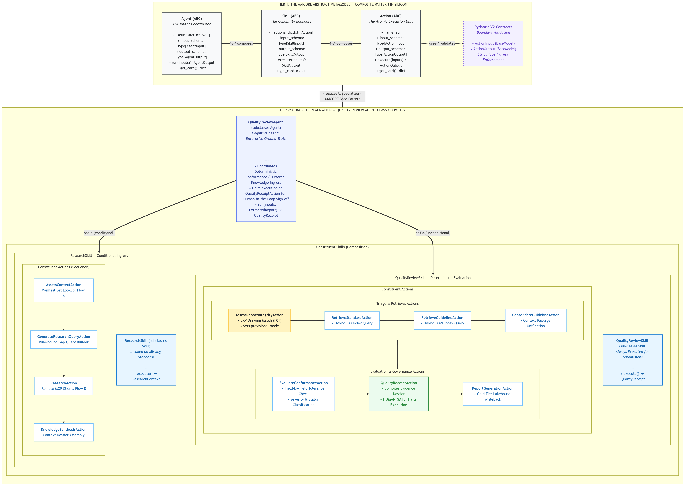

Underneath the friendly dictionaries of LangGraph lies Google Pregel's bulk-synchronous parallel processing.

```python
from langgraph.channels.named_barrier_value import NamedBarrierValue
from langgraph.pregel import Pregel

def analyze_channels():
    # Channel writes trigger state serialization
    pass
```

Here is the architectural layout:

